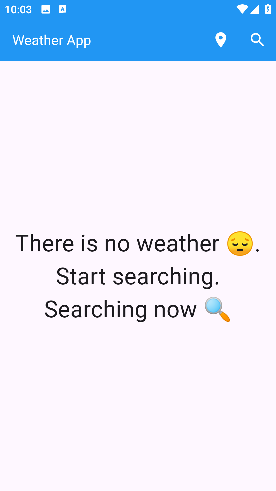
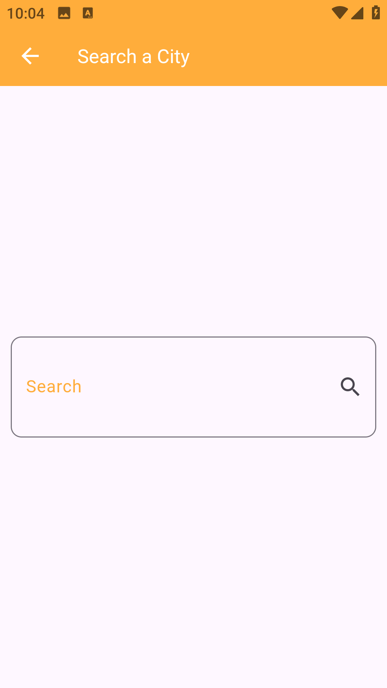
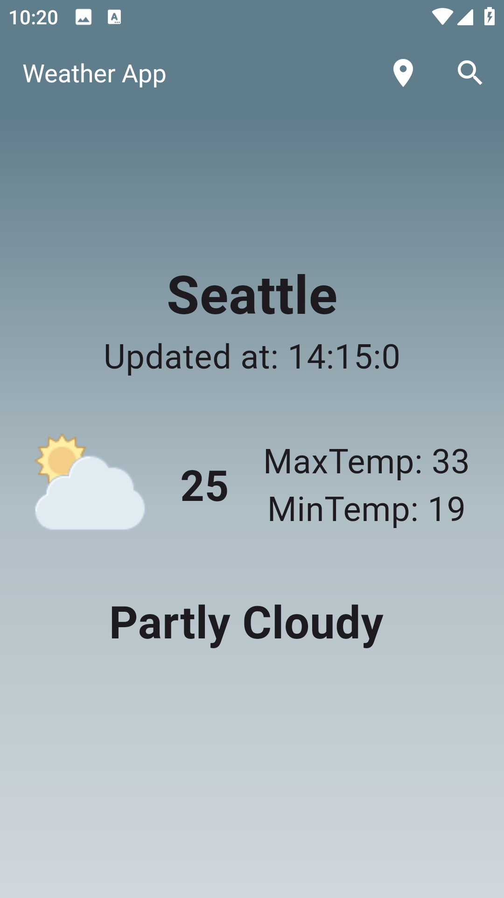
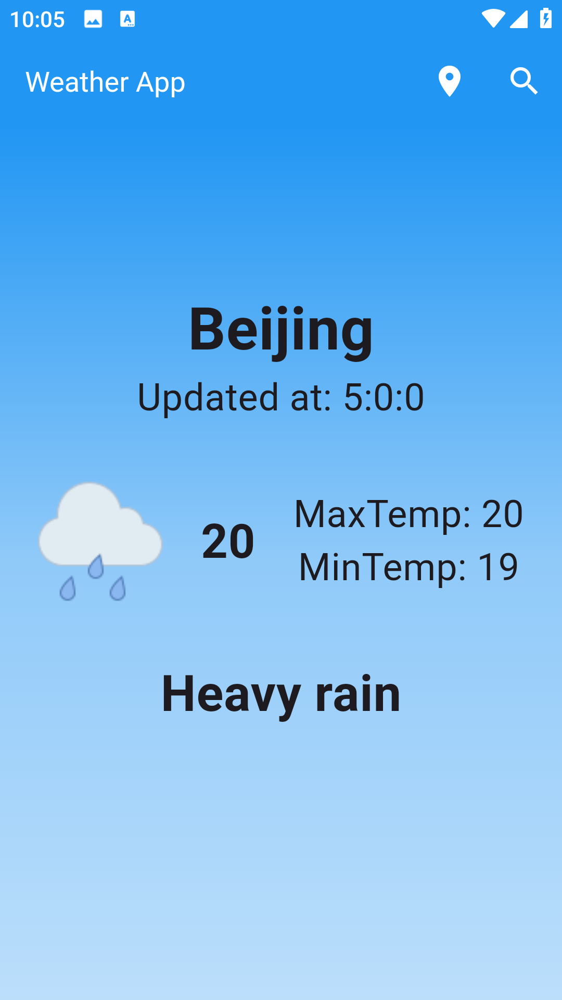

# 🌦️ Weather App

A simple and elegant **Flutter Weather App** that provides real-time weather updates and 7-day forecasts.  
The app uses the [WeatherAPI](https://www.weatherapi.com/) to fetch live weather data and the **Geolocator** package to detect your current location automatically.

---

## 🚀 Features
- 📍 Get weather by **current location** using Geolocator.
- 🌍 Search weather by **city name**.
- ☀️ **7-day forecast** with details.
- 🌡️ Shows temperature, weather condition, and location.
- 🖼️ Clean UI with different weather states (Sunny, Cloudy, Rainy, etc.).

---

## 🛠️ Tech Stack
- **Flutter** 🐦
- **Dart**
- **WeatherAPI** (for weather data)
- **Geolocator** (for location services)

---

## 📷 Screenshots

| Start Page | Search Page | Sunny State | Cloudy State | Rain State |
|------------|-------------|-------------|--------------|------------|
|  |  |  |  |  |

---

## ⚡ Getting Started

### 1️⃣ Clone the repository
```bash
git clone https://github.com/your-username/weather_app.git
cd weather_app
